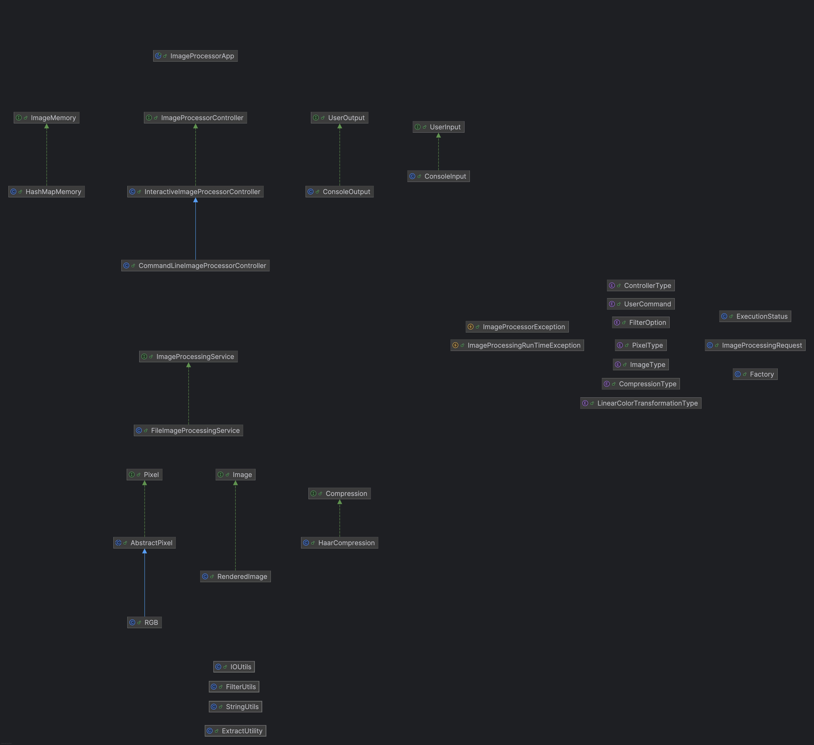
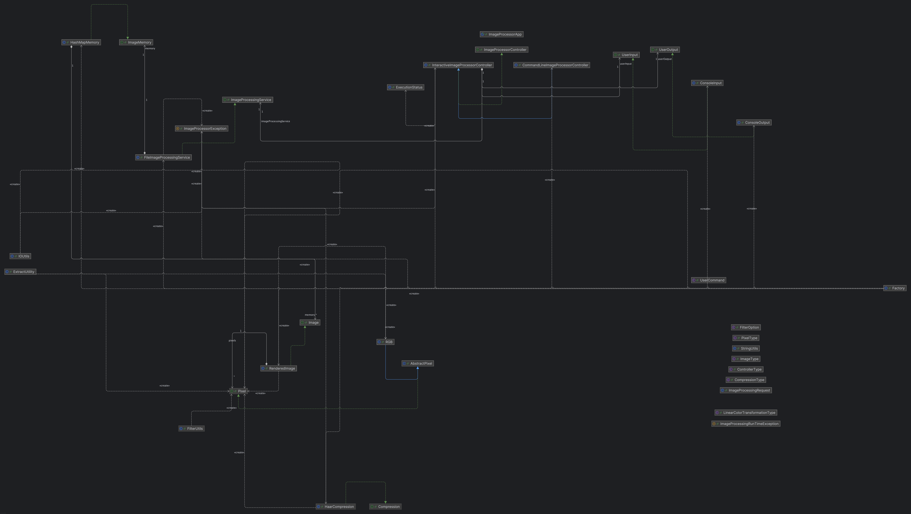

# Image Processor Application

## Setup
### Prerequisites
- Java version 11.0.24

## Steps to Run The Program
- Clone the repository.
- Open the project in an IDE.
- ### Interactive Mode Using IntelliJ IDEA
  - run `src/app/ImageProcessorApp.java`
  - execute the command `run sample-script.txt` on the console (If you face any errors while loading the file, make sure the project root is set to current working directory.).
  - The console in the beginning will display the list of commands that can be executed.
  - If the list needs to be viewed again type `help` in the console or refer to [USEME.md](USEME.md).
- ### Running the application from JAR file
  - Open the terminal and navigate to the project directory.
  - The jar file is present in res/ folder.
  - Run the following command to execute the jar file:
    - `java -jar res/assignment5.jar`
    - This will open up an interactive console where you can enter commands similar to the interactive mode in IntelliJ IDEA.
  - If you need to directly execute the script file:
    - `java -jar res/assignment5.jar sample-script.txt`
    - If you face any errors make sure you are in the project directory and not in res folder.
- Output images will be saved in `res/` folder.
- Script image file is in `res/sample_input.png` 
- To view test input files for test go to `test_resources/input/`
- To test for a better image use `test_resources/input/dubai.png`

## Design changes done in the project
- We didn't need to do much core design changes since the previous assignment due to MVC architecture, we could easily add new features and functionalities.
- Added an additional package `compressors` to implement different compression techniques.
- We added the newer features onto the Image interface due to the fact that this was being used throughout the program and extending to a new interface(for instance ImageWithAdditionalFeatures) would lead us using the new interface everywhere in the program. This would lead us to change existing code in other places(such as ImageMemory) even though the features added had no relation to these classes. So adding additional methods to the controller, service and model classes was the best approach.
- The communication between the controller and the service was now changed from function arguments to `ImageProcessingRequest` object built on Builder pattern. This was done to provide easier way to add new command line arguments in the future without having to change the function signature everywhere. 
- The services was a separate package before. This was moved inside controller after discussing with the professor to help with understanding that services is an extension to controller(MVCS architecture) that handles storing images.
- There were few methods like filter operations which were called from service directly using filter utils, this led to a question on which methods goes to model and which method gets called directly from service which was an unnecessary decision the service had to make. It made sense to move all image operations(other than load/save) to the image model since it was responsible for handling the image data, hence replaced calling filters directly but through the model. 
- A new controller was added to handle and understand the command line arguments by simply extending the existing(InteractiveImageProcessorController) controller and changing the processCommand to help with the processing command line input. 

## Image Citation
- Testing image for script `res/sample_input.png` was taken from [dummyimage.com](https://dummyimage.com/)
- Testing image `test_resources/input/dubai.png` is our own photo and is authorized to be used in this project.
- Testing images `test_resources/input/random.jpeg`,`test_resources/input/random.jpg`,`test_resources/input/random.png`,`test_resources/input/random.ppm` are generated from our own scripts and are authorized to be used in this project.
- Images in res/ folder are generated from our own Image Processor Application and are authorized to be used for evaluation.
- Class diagrams are generated using IntelliJ IDEA and are authorized to be used for evaluation.

## Note: All parts of the project are implemented and tested. Below is the detailed explanation of each part of the project.

## Packages and MVC Structure
### `app` Package
- **Class**: `ImageProcessorApp`
    - **Purpose**: The main class for the Image Processor application. This class is responsible for creating the controller and running the application.

### `compressors` Package
- **Interfaces**:
    - `Compression`
        - **Purpose**: Interface for image compressors. Provides a method to compress an image.
- **Classes**:
- `HaarCompression`
    - **Purpose**: Concrete class that implements the `Compression` interface and provides the implementation for compressing an image using the HAAR compression.

### `controller` Package
- **Interfaces**:
    - `ImageProcessorController`
        - **Purpose**: The controller interface for the image processor. This is responsible for handling the image module and communication with the view.
- **Packages**
  - `services`
    - **Interfaces**:
        - `ImageProcessingService`
            - **Purpose**: Interface for image processing services. Service class to help with all image processing operations.
      - **Classes**:
          - `SimpleImageProcessingService`
              - **Purpose**: FileImageProcessingService class that implements the `ImageProcessingService` interface and provides the implementation for the methods to process images. It uses the ImageMemory object to store and retrieve images.
- **Classes**:
    - `InteractiveImageProcessorController`
        - **Purpose**: This class Implements the `ImageProcessorController` interface and processes the commands entered by the user. It provides a way for user to interact with the program.
    - `CommandLineImageProcessorController.java`
        - **Purpose**: This class Implements the `ImageProcessorController` interface and processes the commands entered by the user. It is used to understand the arguments provided through command line.
    - `ExecutionStatus`
        - **Purpose**: ExecutionStatus class that represents the status of the execution of a command. It contains a boolean value to indicate the success of the execution and a message.
    - `ControllerType`
        - **Purpose**: Enum representing the different types of controllers available.

### `exception` Package
- **Classes**:
    - `ImageProcessingRunTimeException`
        - **Purpose**: A generic runtime exception that is used across the image processing application.
        - **Subclasses**:
          - DisplayException
              - **Purpose**: An exception that is thrown when there is an error displaying a message.
          - QuitException
            - **Purpose**: An exception that is thrown when the user wants to quit the application.
    - `ImageProcessorException`
      - **Purpose**: A generic exception that is thrown across the image processing application when there is an error processing an image.
      - **Subclasses**:
          - NotFoundException
              - **Purpose**: An exception that is thrown when an image is not found in the memory.
          - NotImplementedException
              - **Purpose**: An exception that is thrown when a method is not implemented.

### `factories` Package
- **Classes**:
    - `Factory`
      - **Purpose**: Factory class to create objects for the Image Processor application.

### `model` Package
- **Enumerable**:
  - `CompressionType`
    - **Purpose**: Enum representing the different types of compressions available.`
  - `FilterOption`
    - **Purpose**: Enum representing the different filter options available.
  - `ImageType`
      - **Purpose**: Enum that represents different types of images.
  - `LinearColorTransformationType`
    - **Purpose**: Represents the type of linear transformation that can be applied to an image.
  - `PixelType`
      - **Purpose**: Enum that represents different types of pixels.
  - `UserCommand`
      - **Purpose**: Enum representing the user commands. These are possible commands that the user can give to the program.
- #### `memory` Package
    - **Interfaces**:
        - `ImageMemory`
            - **Purpose**: A class that represents a memory that stores images. The memory can store images and retrieve them by their name. Memory is stored depending on the implementation.
    - **Classes**:
        - `HashMapImageMemory`
            - **Purpose**: Concrete class that implements the `ImageMemory` interface using a HashMap to store images.
- #### `pixels` Package
    - **Interfaces**:
        - `Pixel`
            - **Purpose**: Interface for to represent a Pixel.
    - **Classes**:
        - `AbstractPixel`
            - **Purpose**: Abstract class that provides common functionality for all pixel classes.
        - `RGB`
            - **Purpose**: Concrete class that represents an RGB pixel. 
- ### `request` Package
  - **Classes**:
      - `ImageProcessingRequest`
          - **Purpose**: Represents a request to process an image. It contains the image name and the parameters for the command.
- #### `visual` Package
    - **Interfaces**:
        - `Image`
            - **Purpose**: Interface to represent an Image.
    - **Classes**:
        - `RenderedImage`
            - **Purpose**: Concrete class that represents a rendered image. An image is a sequence of pixels.

### `utility` Package
- **Classes**:
    - `FilterUtils`
        - **Purpose**: Utility class for applying filters to an image. Provides a method to apply a filter to an image.
    - `IOUtils`
        - **Purpose**: Utility class for IO operations.
    - `StringUtils`
        - **Purpose**: Utility class for String operations.
    - `ExtractionUtils`
        - **Purpose**: Utility class for extracting information from image.

### `view` Package
- #### `input` Package
    - **Interfaces**:
        - `UserInput`
            - **Purpose**: Interface for user input. This input can be from any source like console, file etc.
    - **Classes**:
        - `ConsoleInput`
            - **Purpose**: Concrete class that implements the `UserInput` interface and provides console-based user input.
- #### `output` Package
    - **Interfaces**:
        - `UserOutput`
            - **Purpose**: Interface for user output. Represents the output to the user.
    - **Classes**:
        - `ConsoleOutput`
            - **Purpose**: Concrete class that implements the `UserOutput` interface and provides console-based user output.

## MVC Architecture

This project follows the Model-View-Controller (MVC) architecture, which helps in organizing the codebase into three main components:

1. **Model**:
- **Purpose**: Represents the data and the business logic of the application.
- **Packages**:
    - `model/memory`: Manages image memory through interfaces like `ImageMemory` and classes like `HashMapImageMemory`.
    - `model/pixels`: Contains interfaces and classes for pixel representation, such as `Pixel`, `AbstractPixel`, and `RGB`.
    - `model/visual`: Contains interfaces and classes for image representation, such as `Image` and `RenderedImage`.
2. **View**:
- **Purpose**: Handles the presentation layer and user interface.
- **Packages**:
    - `view.input`: Contains interfaces and classes for user input, such as `UserInput` and `ConsoleInput`.
    - `view.output`: Contains interfaces and classes for user output, such as `UserOutput` and `ConsoleOutput`.

3. **Controller**:
- **Purpose**: Manages the flow of the application, processes user commands, and updates the model and view.
- **Packages**:
    - `controller`: Contains interfaces and classes for controlling the application, such as `ImageProcessorController`, `SimpleImageProcessorController`, and `ExecutionStatus`.
    - `controller/services`: Contains interfaces and classes for image processing services, such as `ImageProcessingService` and `SimpleImageProcessingService`.

4. **Class Diagram**:
- The class diagram  just has classes without dependencies for cleaner view.
- The class diagram  has classes with dependencies to understand how the dependencies are between classes.
- The class diagram  has classes,dependencies and methods to see the entire structure of the project.
- This was done to help better understand the structure of the project and how the classes are related to each other.